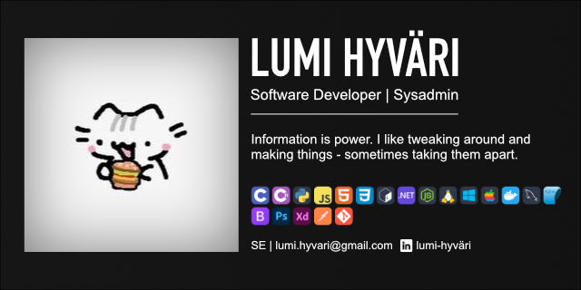

# Lumi Hyväri
The name is Lumi and I like borgir and programming. I also enjoy various niche IT-security fields such as reverse engineering.

💻 Competent primarily in C/C++, Javascript, Python and C#. 
🪙 Able to develop website applications using HTML/CSS, JS, and NodeJS. 
🐧 More than familiar with Linux systems. 
🎨 Enjoy doing digital design using Affinity Design. 
🔐 Enthusiastic about cybersecurity, kernel internals, networking, homelabbing and more. 
📜 Currently working to get certified in ISC2 CC. 
📔 Learning ASP.NET and CSS Bootstrap. 
💪 Started doing Hackerrank as well! :3

> [!NOTE]
> This is a new account since I was locked out of my old one.

### Projects
---
> [!NOTE]
> I am in the process of revamping my old projects to enhance and implement features, change tech stacks, etc. to make them the best version they could be.

| Name                                                    | Description                            | Ready   | Date  | Tech |
|---------------------------------------------------------|----------------------------------------|---------|-------|------|
|     | Media streaming service   | No   | 2026- | NodeJS, Typescript |
|         | C memory protection library            | No      | 2024-<continues> | C |
|     | Web app for reading helpviewer files   | Kinda   | 2026 | NodeJS |
|  AIVI   | AI chatbot using a random forest algorithm and corpuses   | <No>   | 2020-2022 | Python |

### Competencies

---

### Web Design
|                     |        |
|---------------------|--------|
| HTML/CSS            | ★☆☆    |
| Bootstrap           | ☆☆☆    |
| Adobe Prototype XD  | ★☆☆    |

### Digital art
|                     |        |
|---------------------|--------|
| Adobe Photoshop     | ★★☆    |
| Affinity Design     | ★★☆    |
| GIMP                | ★★☆    |

#### Programming
|                     |        |
|---------------------|--------|
| C/C++               | ★★★    |
| C#                  | ★★★    |
| Python              | ★★★    |
| Javascript          | ★★☆    |

#### Frameworks
|                     |        |
|---------------------|--------|
| .NET                | ★★☆    |
| NodeJS              | ★★☆    |
| Express             | ★☆☆    |

#### Databases
Capable of writing SQL scripts, creating databases, normalizing, and deploying them.

#### Deployment
Familiar with Docker containers and am currently learning how to deploy Proxmox VMs and planning to learn Kubernetes.

#### Networking
Knowledgeable about network stacks, protocols, network structures and devices, and how to use tools such as Wireshark and Postman for troubleshooting and API-testing.

#### SRE
Dabbles in the art of software reverse engineering using tools such as Ghidra, Binary Ninja, and IDA.

#### Systems
Uses Linux as a daily driver and is more than familiar with setting up, configuring, and troubleshooting linux systems.
Also a kernels Enthusiast.
