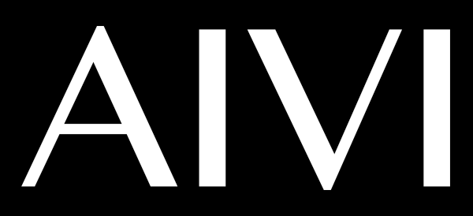

# Hello!
My name is Lumi and I am a fullstack developer. In my spare time I hack away at niche projects, some of which you may find here. I reside in Stockholm and study @ Chas Academy.

### Projects

| Name                                                    | Description                            | Ready   | Date  | Tech |
|---------------------------------------------------------|----------------------------------------|---------|-------|------|
|     | Home network and mini-datacenter   | Yes   | 2024-[2026]- | Proxmox, Wazuh, Suricata, Gitea, ... |
|     | Media streaming service   | No   | 2026- | NodeJS, Typescript |
|         | C memory protection library            | No      | 2024-<continues> | C |
|     | Web app for reading helpviewer files   | Kinda   | 2026 | NodeJS |
|  AIVI ![[Rebooted]](https://github.com/lumiwyou/aivi-rebooted)   | AI chatbot using markov chaining and text corpuses   | No   | 2020-2021-[2026] | Python |

### Competencies

---

### Web Design
|                     |        |
|---------------------|--------|
| HTML/CSS            | ★☆☆    |
| Bootstrap           | ★☆☆    |
| Adobe Prototype XD  | ★☆☆    |

### Digital art
|                     |        |
|---------------------|--------|
| Adobe Photoshop     | ★★☆    |
| Affinity Design     | ★★☆    |
| GIMP                | ★★☆    |

#### Programming
|                     |        |
|---------------------|--------|
| C/C++               | ★★★    |
| C#                  | ★★☆    |
| Python              | ★★★    |
| Javascript          | ★★☆    |

#### Frameworks
|                     |        |
|---------------------|--------|
| .NET                | ★★☆    |
| NodeJS              | ★★☆    |
| Express             | ★☆☆    |
